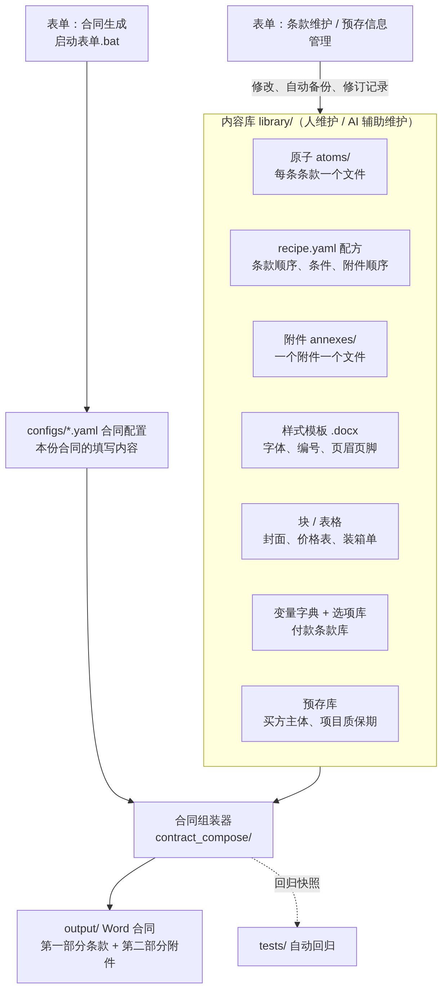

# 合同生成工具（FA 框架合同 / PO 实采合同）

> 目标：合同里只填少数几个变量，其余全部按公司模板自动生成。

合同 = **原子**（每条条款一个文件）× **配方**（条款顺序与条件）× **样式模板** × **块 / 表格** × **变量与选项**，生成的 Word 包括第一部分条款和第二部分附件。内容在 `library/`，程序在 `contract_compose/`；改条款、加合同类型都不需要改代码，条款和变量可以直接在表单的“条款维护”页面中维护。



## 快速开始

1. 首次使用：双击 `安装依赖.bat`（需已安装 Python）。
2. 双击 `启动表单.bat`，浏览器打开表单（http://localhost:8501）：选合同类型 → 填必填信息 → 在“④ 合同附件”中勾选附件 → 点“生成合同”。
3. Word 保存在 `output/`，填写内容保存在 `configs/`，下次可直接打开修改。
4. 条款要更新时，在表单左侧“条款维护”中查找条款，直接修改文字、调整顺序、新增或移除条款；在“变量”中改默认值，或把条款文字改成变量（自动备份、记修订记录）。买方主体、项目质保期在“预存信息管理”中维护。

命令行（在项目根目录）：

```
python -m contract_compose configs/示例_FA_防腐油漆.yaml   # 按配置生成
python -m contract_compose --母本 PO                       # 用默认值生成，与母本比对
python -m contract_compose --标注 PO                       # 生成变量标注版
python -m contract_compose.atom_index                     # 更新各类型的原子总览
python -m contract_compose.health_check 母本.docx          # 母本体检（或把文件拖到 体检.bat）
python -m pytest tests                                    # 回归测试（先 pip install -r requirements-dev.txt）
```

## 目录

| 路径 | 内容 |
|---|---|
| `library/` | 内容库：`common/` 共用（变量字典、付款条款库、选项库、预存库），`FA/`、`PO/` 各类型（`type.yaml`、`recipe.yaml`、`atoms/`、`annexes/` 附件、`templates/`…） |
| `contract_compose/` | 组装引擎（Python 包） |
| `ui/`、`app.py` | 表单页面：合同生成、预存信息管理、条款维护 |
| `configs/`、`output/` | 合同配置；生成的合同 |
| `new_types/` | 新增合同类型的中间产物（体检报告等） |
| `tests/` | 回归快照与表单测试 |
| `docs/` | 文档与流程图 |

## 下一步计划

详见 [docs/路线图.md](docs/路线图.md)：
1. **新建合同模板**：表单中的“新建合同类型”向导，上传母本后按步骤完成，录入新合同更顺畅。
2. **条款与预存信息管理**：选项库、付款条款在页面中维护，跨条款查找替换，Word 修订往返。
3. **变量管理**：变量的新增、删除、重命名、类别与表单显示名，变量检查报告。
4. **附件**：为现有合同模板（PO）补齐附件。
5. **UI**：合同生成按步骤引导、生成前预览、目录树等，尽量减少操作。
6. **精简体量**：盘点架构、功能和代码，按维护成本与实际收益决定保留、合并或删除。

## 文档

| 文档 | 内容 |
|---|---|
| [docs/使用手册.md](docs/使用手册.md) | 生成合同、条款维护页面、在哪里改什么、原子标记、变量、付款、价款、不适用条款、回归检查 |
| [docs/新增合同类型.md](docs/新增合同类型.md) | 合同类型的组成、`type.yaml`、从母本到原子库的步骤 |
| [docs/架构.md](docs/架构.md) | 目录结构、代码模块、组装流程、维护约定 |
| [docs/路线图.md](docs/路线图.md) | 功能清单、后续待办、当前进度 |
| [CLAUDE.md](CLAUDE.md) | AI 维护本项目时的要点 |
