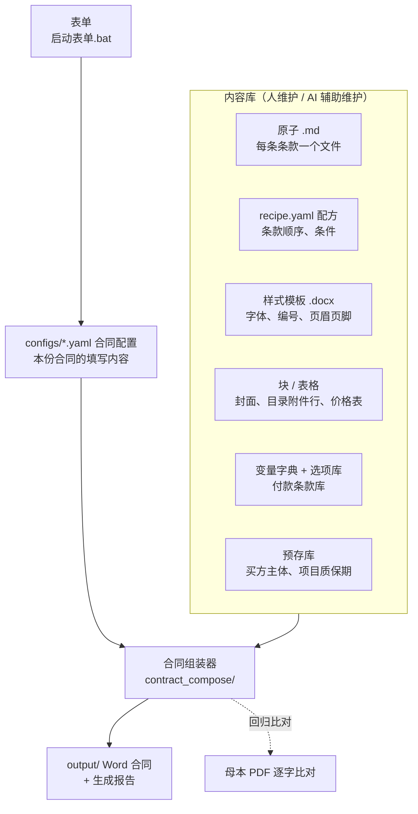
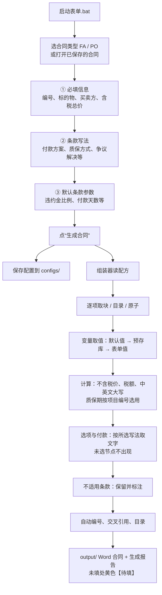
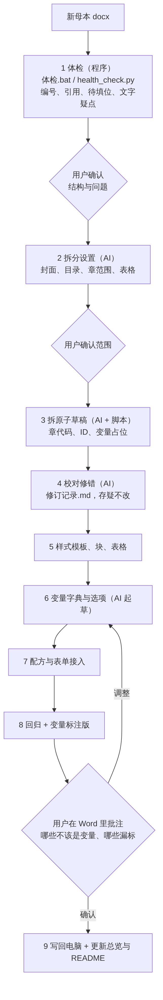
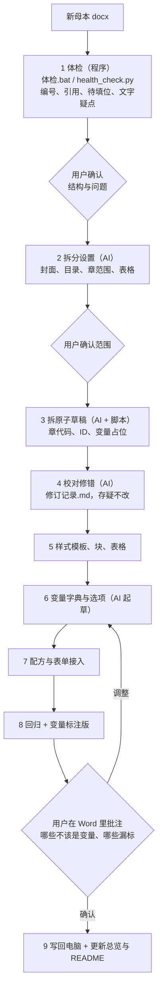
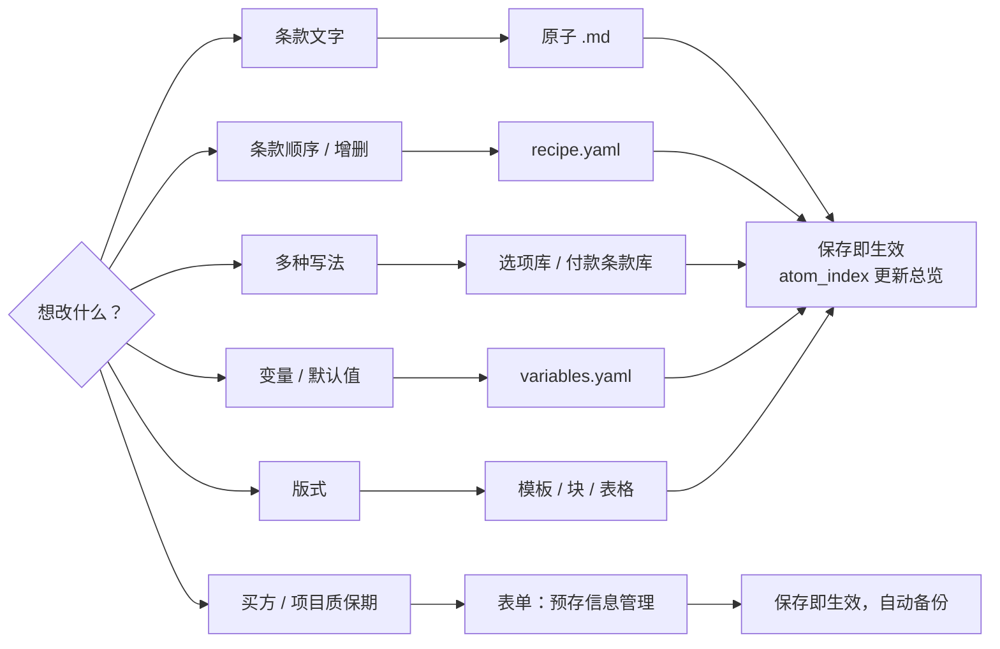

# 合同生成工具（FA 框架合同 / PO 实采合同）

> 目标：合同里只填少数几个变量，其余全部按公司模板自动生成。
> 流程图（Mermaid 源码 + PNG）在 `docs/diagrams/`；本文档里的图在 Obsidian、VS Code、GitHub 中可直接显示，其他编辑器请看 PNG。

## 目录
一、总体流程与流程图　二、功能清单　三、后续待解决事项　四、使用与维护手册（以下为原有内容：基本逻辑、生成合同、目录结构、日常维护、预存信息、FA 与 PO 的区别、原子 ID 与标记、付款、价款、质保期、技术协议、不适用条款、变量、回归检查）　五、当前进度

---

## 一、总体流程与流程图

合同 = **原子**（每条条款的文字，ID 固定）× **配方**（条款顺序与条件）× **样式模板**（字体、编号、页眉页脚）× **块 / 表格**（封面、目录附件行、价格表）× **变量与选项**（每份合同不同的内容）。

### 1. 总体架构

### 2. 生成一份合同（日常使用）

### 3. 新增合同类型（母本 → 原子库 + 变量）
由 skill `contract-master-to-atoms` 驱动：**程序发现问题，AI 判断和修改，用户拍板**；每步结束停下来等用户确认；拿不准法律原意的写入“存疑”，不擅自改。

| 步骤 | 做什么 | 谁做 | 产出 |
|---|---|---|---|
| 0 | 确认类型名、母本、语言顺序、章号起点，找最相近的已有类型 | AI + 用户 | — |
| 1 | 体检：编号、引用、待填位、文字疑点、结构大纲 | 程序 | `new_types/<名>/体检报告.md`、`段落.json` |
| 2 | 划定封面、目录、章范围、价格表等范围，起章代码 | AI，用户确认 | `new_types/<名>/拆分设置.md` |
| 3 | 拆原子草稿：一条款一文件，去掉手打编号，引用改 `{{ref:ID}}` | AI + 脚本 | `library/<类型>/atoms/` |
| 4 | 校对修错，写修订记录；存疑不改 | AI，用户拍板存疑 | `library/<类型>/修订记录.md` |
| 5 | 样式模板、块、表格 | AI | `templates/`、`blocks/`、`tables/` |
| 6 | 变量字典与选项库（复用共用库） | AI 起草，用户确认 | `variables.yaml`、`options/` |
| 7 | 配方，接入组装器与表单，生成示例合同 | AI | `recipe.yaml`、`configs/示例_*.yaml` |
| 8 | 回归（与母本逐字比对）+ 变量标注版，用户在 Word 批注 | AI + 用户 | `<类型>母本_变量标注版.docx` |
| 9 | 写回电脑，更新原子总览与 README | AI | — |

### 4. 日常维护（改什么、去哪改）

---

## 二、功能清单

| 模块 | 功能 | 入口 / 文件 | 状态 |
|---|---|---|---|
| 内容库 | 原子（FA 106 条，PO 154 条）、配方、样式模板、块、表格 | `library/FA/`、`library/PO/` | 已完成 |
| 内容库 | 共用变量字典、类型专属变量字典（同名以类型专属为准） | `library/common/variables.yaml`、`library/<类型>/variables.yaml` | 已完成 |
| 内容库 | 选项库（付款方式、质保方式、质保期共用；包装、运输、争议解决等按类型） | `library/common/options/`、`library/<类型>/options/` | 已完成 |
| 内容库 | 付款条款库：节点和单据按 `FA:` / `PO:` 区分，按方案组装 | `library/common/payment_terms.yaml` | 已完成 |
| 预存库 | 买方主体、项目质保期；表单中增删改，自动备份 | `library/common/presets/`、表单“预存信息管理” | 已完成 |
| 生成 | 表单：选类型、填必填、换写法、改默认参数；保存与重新打开合同配置 | `启动表单.bat`、`ui/contract_form.py` | 已完成 |
| 生成 | 组装器：按配方取原子，变量替换，选项与付款组装，价款计算，大写，不适用标注，自动编号、引用、目录 | `contract_compose/` | 已完成 |
| 生成 | 未填项黄色【待填：…】；价款自动计算（含税→不含税/税额/中英文大写） | 组装器 | 已完成 |
| 验证 | 回归：`--母本 <类型>` 用默认值组装，与母本转 PDF 逐字比对 | 组装器 | 已完成 |
| 验证 | 自动回归测试：示例配置、母本回归、变量标注版与快照逐字比对；表单冒烟测试 | `python -m pytest tests` | 已完成 |
| 验证 | 变量标注版：`--标注 <类型>` 生成黄色高亮的 `【变量：名称｜母本原值】` 母本 | 组装器 | 已完成 |
| 新增类型 | 母本解析：还原 Word 实际编号、手打编号、样式、表格 | `contract_compose/master_parser.py` | 已完成 |
| 新增类型 | 体检：编号、引用、待填位、文字疑点；拖文件到 `体检.bat` | `contract_compose/health_check.py`、`体检.bat` | 已完成，需增强（见三之 1） |
| 新增类型 | 拆原子、建类型的通用脚本 | 暂无，AI 每次写一次性脚本放 `new_types/<名>/` | **未做** |
| 新增类型 | AI 工作流 skill | `contract-master-to-atoms` | 已建，随工具完善而更新 |
| 维护 | 生成原子总览（按条款号查文件名） | `python -m contract_compose.atom_index <类型>` | 已完成 |
| 附件 | 附件生成（价格表、技术协议、保函格式等）、附件目录调整 | — | **未做**（见三之 3） |
| AI 上下文 | 澄清表、偏离表、谈判纪要等 | — | 构想 |

---

## 三、后续待解决事项

宗旨：**今后任何新增或修改，都要让用户尽可能自己能维护，或者让 AI 借助 skill 直接去做。** 下面四项是下一阶段要解决的问题。

### 1. 新增合同模板：怎样方便地新增并形成可用内容？
- 现状：skill 已定义 10 步流程，体检工具已有；拆原子靠 AI 每次写一次性脚本，没有通用的一键工具。
- 要做：
  - [ ] 体检工具识别手打编号的合同：章号“一、”“第X章”，条款号“1.1”（S416 合同已发现结构大纲为空）。
  - [ ] 做通用 `新建合同类型.py`：读体检结果和拆分设置，自动生成原子草稿、配方、变量字典雏形。
  - [ ] 做“拆分设置”模板，用户只需确认范围和章代码。
  - [ ] 用 F520 PO 母本重新生成一遍 PO 库，验证通用脚本与现有库一致（回归）。
  - [ ] 中文单语合同（S416）、英文单语、中英对照三种语言结构都要支持。
  - [ ] 表单里增加“新增合同类型”入口：上传母本 → 显示体检报告 → 提示下一步让 AI 处理。
- 试用中：S416 VLCC 中文采购订单。体检已完成，等用户确认缺章（七、十八）和是否合并英文版，再进第 2 步。

### 2. 已有合同模板：怎样方便地新增和更新变量？
- 现状：新增变量要同时改三处：原子里写 `{{变量}}`、变量字典登记、必要时选项库；要懂 yaml 和标记。
- 要做：
  - [ ] 标注版反馈闭环：用户在变量标注版 Word 里批注“这里应是变量 / 这个不该是变量”→ AI 读取批注，自动改原子、变量字典，并重新回归。
  - [ ] 表单增加“变量管理”页：列出变量、所在条款、默认值、母本原值，可增删改（类似预存信息管理）。
  - [ ] 增加“变量使用检查”工具：原子里用了但字典没有、字典有但没用到的变量，自动报告。
  - [ ] 写 skill `contract-variable-maintenance`：用户用一句话（“把 PO 9.3 的质保期改成变量”）说明，AI 完成改原子、改字典、回归、写修订记录。
  - [ ] 变量改动写入修订记录，并保留版本。

### 3. 合同附件生成：计划与附件目录调整
- 现状：只生成合同正文；封面、目录附件行、价格表以块 / 表格形式存在；附件本身（技术协议、保函格式、保密协议等）未纳入。
- 要做：
  - [ ] 盘点 FA、PO、S416 各自的附件清单，分类：固定文本 / 带变量的表格 / 由别处提供的文件（如技术协议）。
  - [ ] 设计“附件库”：像原子一样一份附件一个文件，配方里增加附件顺序，支持“不适用”。
  - [ ] 附件目录自动生成：按所选附件生成目录里的附件行和编号（现在是固定块），选了不适用的附件自动标注。
  - [ ] 正文引用附件时用 `{{ref:附件ID}}`，增删附件后编号和引用自动更新。
  - [ ] 附件与主合同一同输出（合并或分文件，待定）。

### 4. 维护方式：让用户尽量自己维护，或交给 AI 去做
- 原则：用户只管“说要什么”和“拍板”，AI 负责改文件、跑检查、写修订记录。
- 要做：
  - [ ] **skill 体系**：`contract-master-to-atoms`（新增类型，已建）；`contract-variable-maintenance`（改变量）；`contract-clause-maintenance`（改条款文字、增删条款、改写法、改配方）；`contract-generate`（用对话代替表单生成合同）。每个 skill 约定：先改、再跑回归、再写修订记录、再汇报。
  - [ ] **安全护栏**：所有修改前自动备份；改动必须写入修订记录；改共用库后必须重跑 FA、PO 回归，输出不变才算完成。
  - [ ] **脚本化而非靠记忆**：能固化成工具的步骤（体检、总览、回归、变量检查）做成命令或 .bat，用户双击即可，不依赖 AI 记得怎么做。
  - [ ] 一份“维护手册”（在本 README 第四部分的基础上，用问答方式写“我想……怎么办”）。
  - [ ] AI 上下文层（构想）：澄清表、偏离表、谈判纪要，作为生成合同时的参考输入。

### 其他待办
- [ ] 逐项处理 `library/PO/修订记录.md` 中的“存疑”清单。
- [ ] 变量标注版：FA 母本标注版尚未生成（PO 已生成并确认）。

---

## 四、使用与维护手册

### 基本逻辑
合同 = **配方**（条款顺序）× **原子**（每条条款的文字）× **样式模板**（字体、编号、页眉页脚）× **变量与选项**（每份合同不同的内容）。
1. 组装器按 `library/<类型>/recipe.yaml` 的顺序取出 `library/<类型>/atoms/` 中的条款，逐条写入 `library/<类型>/templates/` 中的样式模板。
2. 条款中的 `{{变量}}` 用表单填写的值替换；买方信息、项目质保期从 `library/common/presets/` 自动带出；价款金额、大写等由组装器计算。
3. 有多种写法的条款（付款方式、包装方式、争议解决等）按所选写法从选项库、付款条款库取文字。
4. 章节号、条款号、列项、交叉引用、目录全部自动生成；不适用的条款保留并标注。
5. 未填的内容在 Word 中以黄色【待填：…】标出。

FA 与 PO 的条款原文、配方、样式模板各自独立；组装器、表单、预存库、付款条款库、价款计算、不适用标注等共用一套。

### 生成一份合同（表单）
1. 首次使用：双击 `安装依赖.bat`（需已安装 Python）。
2. 双击 `启动表单.bat`，浏览器会打开表单页面（http://localhost:8501）。
3. 左上角选择**合同类型**（FA 框架合同 / PO 实采合同），在“① 必填信息”中填写本份合同的信息；需要时在“② 条款写法”中换写法，在“③ 默认条款参数”中改默认值。
4. 点“生成合同”：Word 保存在 `output/`，填写内容同时保存到 `configs/`，下次可在“打开已保存的合同”中直接调出修改（自动切换到对应的合同类型）。

未填的必填项会在 Word 中以黄色“【待填：…】”标出；付款比例合计不为 100% 时表单会提示。

也可以不用表单，直接运行：`python -m contract_compose configs/你的配置.yaml`（配置中写 `合同类型: FA` 或 `PO`）。

### 目录结构
| 路径 | 内容 |
|---|---|
| `app.py`、`启动表单.bat`、`安装依赖.bat`、`体检.bat` | 双击入口：表单（左侧切换：合同生成 / 预存信息管理）、安装依赖、母本体检 |
| `requirements.txt`、`requirements-dev.txt` | 运行依赖；开发/测试依赖（pytest） |
| `contract_compose/` | Python 引擎包：`assembler.py` 组装器、`paths.py` 全部路径、`master_parser.py` 母本解析、`health_check.py` 体检、`atom_index.py` 原子总览 |
| `ui/` | 表单页面：`contract_form.py` 合同生成、`preset_manager.py` 预存信息管理 |
| `library/common/` | 共用内容：`variables.yaml` 变量字典、`payment_terms.yaml` 付款条款库、`options/` 选项库（付款方式、质保方式、质保期）、`presets/` 预存库（买方主体、项目信息；`backups/` 为自动备份，不进 git） |
| `library/FA/`、`library/PO/` | 各类型：`atoms/` 原子、`recipe.yaml` 配方、`variables.yaml` 专属变量、`options/` 专属选项、`templates/` 样式模板、`blocks/` 封面/目录附件行/前言等、`tables/` 表格、`reference/` 母本原件、`原子总览.md` |
| `library/FA/reference/FA母本_v2.docx` | FA 批注版母本（回归比对用） |
| `library/PO/PO母本_变量标注版.docx`、`library/PO/修订记录.md` | PO 变量标注版；PO 母本中已修改的错误、改为变量的内容、存疑问题 |
| `configs/` | 每份合同一个配置文件（合同类型、填写的变量、选用的写法） |
| `output/` | 生成的合同和生成报告（不进 git，只保留两份示例） |
| `new_types/` | 新增合同类型的中间产物：体检报告、拆分设置、一次性转换脚本 |
| `docs/diagrams/` | 流程图：Mermaid 源码（.mmd）和 PNG |
| `tests/` | 回归测试：`snapshots/` 快照、`cases/` 额外测试配置；有意修改后用 `python tests/test_regression.py --update` 更新快照 |

### 日常维护：在哪里改什么
| 想改的内容 | 在哪里改 |
|---|---|
| 条款正文文字 | `library/FA/atoms/xxx.md` 或 `library/PO/atoms/xxx.md`（一条一个文件；在该类型的 `原子总览.md` 中按条款号查文件名） |
| 条款顺序、增加或删除条款 | `library/<类型>/recipe.yaml`（新条款先在 `atoms/` 新建 .md，再加入配方；编号自动重排） |
| 有多种写法的条款 | FA：`library/FA/options/`（计算方法、支付方式、交货时间、交货地点、包装方式、运输方式）；PO：`library/PO/options/`（争议解决）；共用：`library/common/options/` |
| 付款节点、付款单据、付款方案 | `library/common/payment_terms.yaml`、`library/common/options/付款方式.yaml` |
| 买方主体信息、各项目的质保期条款 | 表单“预存信息管理”页面（自动备份） |
| 变量默认值（如违约金比例、付款天数） | `library/common/variables.yaml` 或 `library/<类型>/variables.yaml`；单份合同在表单“③ 默认条款参数”中改 |
| 字体、字号、编号格式、页眉页脚 | `library/<类型>/templates/` 中的样式模板（建议告知后再改） |
| 价格表、封面、目录附件行、前言等版式块 | `library/<类型>/tables/`、`library/<类型>/blocks/`（Word 原始 XML，不建议手改） |

改原子 .md 时：保留开头两行 `---` 之间的信息；保留行首标记（`#`、`##`、`- ` 等）；`{{…}}` 不要改成固定文字；文件保存为 UTF-8。保存后下次生成即生效，无需重启表单。增删条款后可运行 `python -m contract_compose.atom_index <类型>` 更新总览。

### 预存信息管理
表单左侧点“预存信息管理”，可查看、修改、新增、复制、删除预存条目，或把某条设为默认（排第一位）；修改保存后生成合同时立即生效。
- 每个预存库是 `library/common/presets/` 下的一个 yaml：`名称`、`说明`、`字段`（变量名 → 显示名）、`条目`。
- 买方主体：两类合同的封面、签署页、法定地址自动带出。项目信息：按项目编号自动选用质保期条款（FA 3.4 b)、PO 9.3）。
- 每次保存前，旧文件自动复制到 `library/common/presets/backups/`（保留最近 30 份），改错了可以从这里找回。

### FA 与 PO 的区别（组装器自动处理）
| | FA 框架合同 | PO 实采合同 |
|---|---|---|
| 语言顺序 | 中文在前 | 英文在前 |
| 章节编号 | 从 1 起；条款 x.y；列项 a) / 1) | 从 0 起（0. DEFINITIONS）；条款 N.M；子条款 N.M.K；列项 a. / 1) |
| 付款条款 | 4.2 下的 a) b) 列项，单据为 1) 2) | 3.2 下的 3.2.1 子条款，单据为 a. b. |
| 付款金额基数 | 每批次订单总价 | 合同总价 |
| 质保担保 | 质保函为到货款单据之一；或预留质保金 | 单独的“质保款”节点；无质保函时质保款改为质保期满后支付 |
| 价格表 | 一张表（含税/不含税/税额行） | 按币种选表：人民币用含增值税表，外币用不含税表 |
| 履约保函 | 4.6，可勾选不适用 | 无此条款 |
| 争议解决 | 固定写法 | 诉讼 / 仲裁 二选一（选诉讼时 19.1–19.3 仲裁细则标注不适用） |

### 原子 ID 规则
`章代码-序号`，如 `QUA-04`；`-00` 为章标题原子，`COM-01-2`、`IND-05-1` 为子条款。ID 一经分配不再改变；条款号由组装时的顺序自动计算。FA 与 PO 的 ID 各自独立（同一代码在两个库中可代表不同条款）。

- FA 章代码：GEN 总则、SCO 供货范围、QUA 质量、PRI 价款与支付、DEL 交货、PAC 包装、TRA 运输、INS 检验验收、PNT 涂装检验、WAR 权利担保、FM 不可抗力、CHG 变更终止、IP 知识产权、CON 保密、LIA 违约责任、DIS 争议解决、OTH 其他约定、COM 沟通渠道。
- PO 章代码（括号内为章号）：DEF 定义(0)、SCO 供货范围(1)、ORI 原产国与制造商(2)、PAY 付款(3)、DEL 货物交付(4)、CHG 变更(5)、PAC 包装和唛头(6)、SHA 发运通知(7)、LD 延迟交付及赔偿(8)、QUA 质量保证(9)、SUR 监造和催交(10)、INS 检验(11)、ERE 安装试运行(12)、ACC 验收(13)、FM 不可抗力(14)、CLA 索赔(15)、IP 知识产权(16)、CON 保密(17)、TER 暂停和终止(18)、DIS 争议解决(19)、EXP 出口管制(20)、CMP 合规(21)、IND 赔偿和保险(22)、ASN 转让(23)、HSE 健康安全环境(24)、MIS 其他(25)、ADR 法定地址(26)、TAX 税收(27)、AUD 审计(28)。

### 原子正文标记（对应 Word 样式）
| 标记 | 样式 |
|---|---|
| `# ` | 合同-章标题 |
| `## ` | 合同-条款（x.y） |
| `### ` | 合同-子条款（x.y.z） |
| `- ` | 合同-列项（FA a)；PO a.） |
| `  - ` | 合同-列项二级（1)） |
| `+ ` | 数字列项（1) 2)，PO 10.3、10.4 使用） |
| `  + ` | 数字列项下的字母列项（a. b.） |
| 无标记 | 合同-正文 |
| 两个空格开头 / 四个空格开头 | 列项续行 / 二级列项续行（如列项的中文译文） |
| `{{变量}}` | 值变量，见变量字典 |
| `{{英文数字:变量}}`、`{{中文数字:变量}}` | 把数字写成英文 / 中文，如 60 → sixty、0.5 → 零点五 |
| `{{选项:名称}}` / `{{选项:名称_en}}` | 选项变量：按所选写法填入中文 / 英文；单独占一行时整段替换（如付款方式、争议解决） |
| `{{选项列表:名称}}` | 列出该选项变量的全部选项（如 a) 新木箱；b) 纸箱…） |
| `{{ref:ID}}` | 引用其他条款，生成时换成实际条款号 |
| `{{table:ID}}` | 插入 `tables/` 中的表格；ID 中的 `$变量` 按变量值选表（如 `PO-SCO-$价款_计税`） |
| `**文字**`、`<u>文字</u>` | 加粗、下划线；`\*` 表示文字中的星号 |

### 付款条款
由 `library/common/payment_terms.yaml` 按所选方案组装（FA 4.2、PO 3.2）：
- **付款方案**（`library/common/options/付款方式.yaml`）
  - FA：预付款+到货款（默认）、到货款一次付清、预付款+进度款+到货款、关键设备（预付+进度+发货+到货+调试）、自定义。
  - PO：简单合同（到货款+质保款，默认）、预付款+到货款+质保款、复杂合同（预付+进度+发货+到货+质保款+调试）、自定义。
- **质保方式**（`library/common/options/质保方式.yaml`）
  - FA：质保函作为到货款的付款单据之一（每批次订单总价的 5%）；或到货款时预留 5% 质量保证金，质保期满后释放。
  - PO：质保款凭质保函和完工文件支付；无质保函时，质保款改为质保期满后支付并排到最后，完工文件移至调试款。
- 方案含预付款时，到货款不再要求“双方签字合同”。
- 母本中标为“可选/Optional”的单据（如原材料质量证明），在表单中勾选后才写入合同。
- 表单会按所选节点显示比例和相关参数输入框（如付款天数、主材名称、完工文件份数），并检查比例合计是否为 100%。
- 新增付款节点或单据：在 `payment_terms.yaml` 中添加（写在 `FA:` / `PO:` 下），再在 `options/付款方式.yaml` 的方案里引用。

### 合同价款（FA 4.1 / PO 第 1 章价格表）
只填**含税总价**和币种，组装器自动计算并填入价格表：
- 不含税价 = 含税价 ÷ (1 + 税率)，四舍五入到分；税额 = 含税价 − 不含税价（三者相加一分不差）。
- 税率默认“（自动）”：人民币 13%，外币（USD/EUR/GBP）不涉及增值税，税率与税额写 N/A。也可手选 9% / 6% / 0%。
- 金额带货币符号、千分位、两位小数，如 ￥1,130,000.00；第 1 行“货物”的金额填含税总价。
- 中文大写（如 壹佰壹拾叁万元整）和英文大写（如 ONE MILLION ONE HUNDRED AND THIRTY THOUSAND ONLY）按所选币种填写。

### 质量保证期（FA 3.4 b) / PO 9.3）
- 填写“项目编号”后自动选用“预存库/项目信息”中该项目的质保期条款（不区分大小写）；没有预设时用模板原文。
- “② 条款写法”中可预览所选条款，也可手动改选其他项目、模板原文或“自定义”（自行填写中英文条款）。

### 技术协议
表单勾选“本合同有技术协议”时填写技术协议号、版本号、日期：FA 写入 1.1 合同组成中的附件 5；PO 写入第 1 章备注中的技术协议编号。不勾选时附件（FA 附件五、PO 附件 C）在目录附件清单中标注“不适用”，正文中引用《技术协议》的条款原样保留。

### 不适用条款
除付款条款外，任何条款都不删除：不适用的条款照常保留，在标题后注明“（不适用 Not Applicable）”（条款文字很长时注在开头），其中未填的变量写 N/A、不标黄。
- 配置写法：`不适用: [INS-00, PRI-06]`；写章标题原子即整章不适用，只在章标题标注。
- FA 履约保函（4.6）：表单勾选“本合同需要履约保函”时填比例；不勾选则条款保留并标注不适用。
- 配方中带“条件”的条款（如 FA 第 9 章涂装检验）在条件不成立时自动标注不适用；带“仅当选项”的条款（如 PO 19.1–19.3 仅当争议解决=仲裁）在选项不符时自动标注不适用。
- 付款条款不做标注：未选用的付款节点直接不出现。

### 变量
- **值变量**：填一个值，如合同编号、标的物名称、交货日期。中英文分开填的以 `_en` 结尾；项目名称、设施简称、业主名称只有英文，中英文条款共用。
- **选项变量**：从选项库中选一种写法，没有指定时用“默认”。交货地点（FA）跟随贸易术语自动选择；质保期按项目编号自动选择。
- 共用变量在 `library/common/variables.yaml`；只在某一类合同中使用的在 `library/FA/variables.yaml`、`library/PO/variables.yaml`（同名时以类型专属为准，如 PO 的贸易术语为必填、无默认值）。

### 回归检查
`python -m contract_compose --母本 FA`（或 `PO`）用全部默认值组装，用于与母本转 PDF 后逐字比对。
- FA：与批注版母本 `library/FA/reference/FA母本_v2.docx` 比对，编号、顺序、目录全部一致，页数相同（32 页）。差异均为有意修改：标的物名称、项目名称等改为变量；4.2 付款按新规则（每批次订单总价、含预付款时到货款不列签字合同、质保金按选择出现）；“Naked clothing” → “Unpacked”；14.5 “本合同14条” → “第14条”；3.4 b) 质保期句末“，”改为“。”。
- PO：与 F520 PO 模板 rev04 比对，章节 0–28、条款编号与母本一致（母本第 24 章之后的章节号错乱已恢复）。差异均为有意修改，见 `library/PO/修订记录.md`。

---

## 五、当前进度（2026-10-06）
- FA 框架合同：原子 106 条，回归 32 页，与批注版母本一致（有意修改见回归检查）。
- PO 实采合同：原子 154 条，章节 0–28，与 F520 PO 模板 rev04 一致；变量标注版已由用户确认。
- 新增类型工具链：体检（程序）+ skill（AI 流程）已就绪；通用拆原子脚本未做。
- S416 VLCC 中文采购订单：已完成第 1 步体检，停在“确认缺章与英文版如何处理”。
  - 结构：27 章，全部手打编号（一、至二十七、），条款号约 62 处手打，列项约 40 处手打。
  - 问题：缺“七、”“十八、”章标题；“十七、”标题与正文粘连；10.2 列项缺 (3)；交叉引用待核对。
  - 变量候选约 23 处：买卖方信息、合同号、签订时间、价格表、交货期、原产地与制造商、船级社、保密协议附件号。
