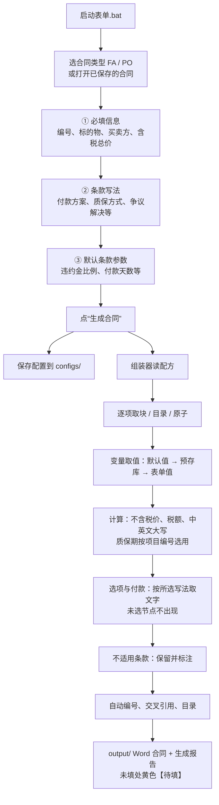
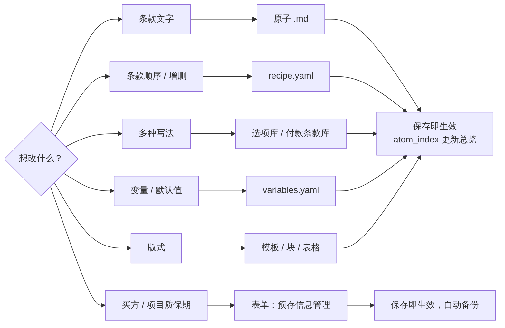
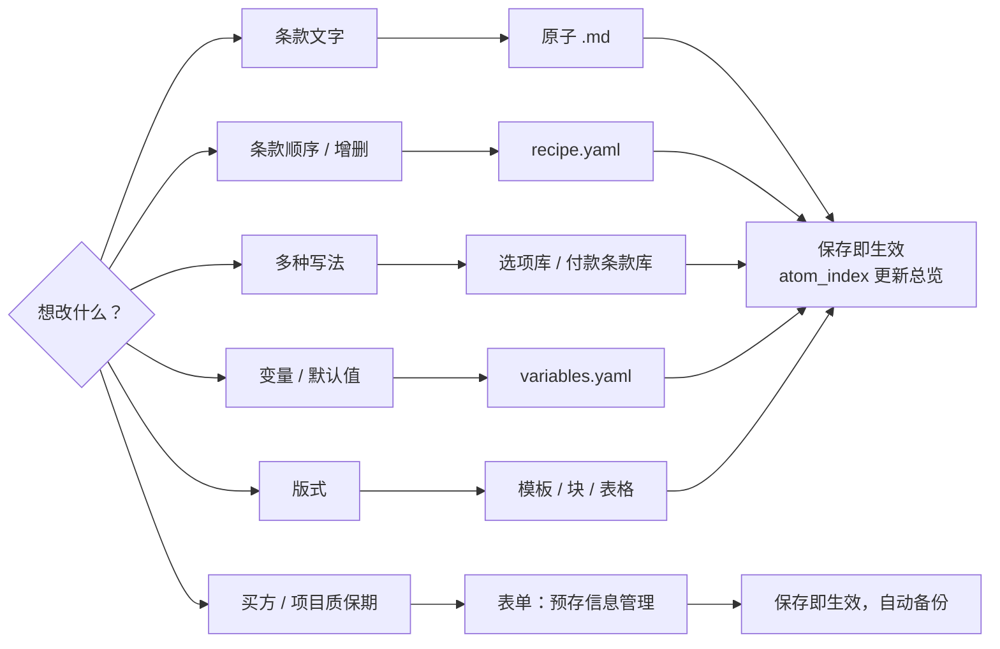

# 使用与维护手册

> 面向使用者：怎样生成合同、在哪里改什么、各项规则。架构与代码见 [架构.md](架构.md)；新增合同类型见 [新增合同类型.md](新增合同类型.md)。

## 基本逻辑
合同 = **配方**（条款顺序）× **原子**（每条条款的文字）× **样式模板**（字体、编号、页眉页脚）× **变量与选项**（每份合同不同的内容）。
1. 组装器按 `library/<类型>/recipe.yaml` 的顺序取出 `library/<类型>/atoms/` 中的条款，逐条写入 `library/<类型>/templates/` 中的样式模板。
2. 条款中的 `{{变量}}` 用表单填写的值替换；买方信息、项目质保期从 `library/common/presets/` 自动带出；价款金额、大写等由组装器计算。
3. 有多种写法的条款（付款方式、包装方式、争议解决等）按所选写法从选项库、付款条款库取文字。
4. 章节号、条款号、列项、交叉引用、目录全部自动生成；不适用的条款保留并标注。
5. 未填的内容在 Word 中以黄色【待填：…】标出。

FA 与 PO 的条款原文、配方、样式模板各自独立；组装器、表单、预存库、付款条款库、价款计算、不适用标注等共用一套。

## 生成一份合同（表单）
1. 首次使用：双击 `安装依赖.bat`（需已安装 Python）。
2. 双击 `启动表单.bat`，浏览器会打开表单页面（http://localhost:8501）。
3. 左上角选择**合同类型**（FA 框架合同 / PO 实采合同），在“① 必填信息”中填写本份合同的信息；需要时在“② 条款写法”中换写法，在“③ 默认条款参数”中改默认值。
4. 点“生成合同”：Word 保存在 `output/`，填写内容同时保存到 `configs/`，下次可在“打开已保存的合同”中直接调出修改（自动切换到对应的合同类型）。

未填的必填项会在 Word 中以黄色“【待填：…】”标出；付款比例合计不为 100% 时表单会提示。

也可以不用表单，直接运行：`python -m contract_compose configs/你的配置.yaml`（配置中写 `合同类型: FA` 或 `PO`）。

修改代码或内容库后，运行 `python -m pytest tests`（需先 `pip install -r requirements-dev.txt`）确认生成结果与快照一致；有意修改条款或模板导致的差异，确认后用 `python tests/test_regression.py --update` 更新快照。

## 生成流程

## 日常维护流程

## 日常维护：在哪里改什么
| 想改的内容 | 在哪里改 |
|---|---|
| 条款正文文字 | `library/FA/atoms/xxx.md` 或 `library/PO/atoms/xxx.md`（一条一个文件；在该类型的 `原子总览.md` 中按条款号查文件名） |
| 条款顺序、增加或删除条款 | `library/<类型>/recipe.yaml`（新条款先在 `atoms/` 新建 .md，再加入配方；编号自动重排） |
| 有多种写法的条款 | FA：`library/FA/options/`（计算方法、支付方式、交货时间、交货地点、包装方式、运输方式）；PO：`library/PO/options/`（争议解决）；共用：`library/common/options/` |
| 付款节点、付款单据、付款方案 | `library/common/payment_terms.yaml`、`library/common/options/付款方式.yaml` |
| 买方主体信息、各项目的质保期条款 | 表单“预存信息管理”页面（自动备份） |
| 变量默认值（如违约金比例、付款天数） | `library/common/variables.yaml` 或 `library/<类型>/variables.yaml`；单份合同在表单“③ 默认条款参数”中改 |
| 字体、字号、编号格式、页眉页脚 | `library/<类型>/templates/` 中的样式模板（建议告知后再改） |
| 价格表、封面、目录附件行、前言等版式块 | `library/<类型>/tables/`、`library/<类型>/blocks/`（Word 原始 XML，不建议手改） |

改原子 .md 时：保留开头两行 `---` 之间的信息；保留行首标记（`#`、`##`、`- ` 等）；`{{…}}` 不要改成固定文字；文件保存为 UTF-8。保存后下次生成即生效，无需重启表单。增删条款后可运行 `python -m contract_compose.atom_index <类型>` 更新总览。

## 预存信息管理
表单左侧点“预存信息管理”，可查看、修改、新增、复制、删除预存条目，或把某条设为默认（排第一位）；修改保存后生成合同时立即生效。
- 每个预存库是 `library/common/presets/` 下的一个 yaml：`名称`、`说明`、`字段`（变量名 → 显示名）、`条目`。
- 买方主体：两类合同的封面、签署页、法定地址自动带出。项目信息：按项目编号自动选用质保期条款（FA 3.4 b)、PO 9.3）。
- 每次保存前，旧文件自动复制到 `library/common/presets/backups/`（保留最近 30 份），改错了可以从这里找回。

## FA 与 PO 的区别（组装器自动处理）
| | FA 框架合同 | PO 实采合同 |
|---|---|---|
| 语言顺序 | 中文在前 | 英文在前 |
| 章节编号 | 从 1 起；条款 x.y；列项 a) / 1) | 从 0 起（0. DEFINITIONS）；条款 N.M；子条款 N.M.K；列项 a. / 1) |
| 付款条款 | 4.2 下的 a) b) 列项，单据为 1) 2) | 3.2 下的 3.2.1 子条款，单据为 a. b. |
| 付款金额基数 | 每批次订单总价 | 合同总价 |
| 质保担保 | 质保函为到货款单据之一；或预留质保金 | 单独的“质保款”节点；无质保函时质保款改为质保期满后支付 |
| 价格表 | 一张表（含税/不含税/税额行） | 按币种选表：人民币用含增值税表，外币用不含税表 |
| 履约保函 | 4.6，可勾选不适用 | 无此条款 |
| 争议解决 | 固定写法 | 诉讼 / 仲裁 二选一（选诉讼时 19.1–19.3 仲裁细则标注不适用） |

## 原子 ID 规则
`章代码-序号`，如 `QUA-04`；`-00` 为章标题原子，`COM-01-2`、`IND-05-1` 为子条款。ID 一经分配不再改变；条款号由组装时的顺序自动计算。FA 与 PO 的 ID 各自独立（同一代码在两个库中可代表不同条款）。

- FA 章代码：GEN 总则、SCO 供货范围、QUA 质量、PRI 价款与支付、DEL 交货、PAC 包装、TRA 运输、INS 检验验收、PNT 涂装检验、WAR 权利担保、FM 不可抗力、CHG 变更终止、IP 知识产权、CON 保密、LIA 违约责任、DIS 争议解决、OTH 其他约定、COM 沟通渠道。
- PO 章代码（括号内为章号）：DEF 定义(0)、SCO 供货范围(1)、ORI 原产国与制造商(2)、PAY 付款(3)、DEL 货物交付(4)、CHG 变更(5)、PAC 包装和唛头(6)、SHA 发运通知(7)、LD 延迟交付及赔偿(8)、QUA 质量保证(9)、SUR 监造和催交(10)、INS 检验(11)、ERE 安装试运行(12)、ACC 验收(13)、FM 不可抗力(14)、CLA 索赔(15)、IP 知识产权(16)、CON 保密(17)、TER 暂停和终止(18)、DIS 争议解决(19)、EXP 出口管制(20)、CMP 合规(21)、IND 赔偿和保险(22)、ASN 转让(23)、HSE 健康安全环境(24)、MIS 其他(25)、ADR 法定地址(26)、TAX 税收(27)、AUD 审计(28)。

## 原子正文标记（对应 Word 样式）
| 标记 | 样式 |
|---|---|
| `# ` | 合同-章标题 |
| `## ` | 合同-条款（x.y） |
| `### ` | 合同-子条款（x.y.z） |
| `- ` | 合同-列项（FA a)；PO a.） |
| `  - ` | 合同-列项二级（1)） |
| `+ ` | 数字列项（1) 2)，PO 10.3、10.4 使用） |
| `  + ` | 数字列项下的字母列项（a. b.） |
| 无标记 | 合同-正文 |
| 两个空格开头 / 四个空格开头 | 列项续行 / 二级列项续行（如列项的中文译文） |
| `{{变量}}` | 值变量，见变量字典 |
| `{{英文数字:变量}}`、`{{中文数字:变量}}` | 把数字写成英文 / 中文，如 60 → sixty、0.5 → 零点五 |
| `{{选项:名称}}` / `{{选项:名称_en}}` | 选项变量：按所选写法填入中文 / 英文；单独占一行时整段替换（如付款方式、争议解决） |
| `{{选项列表:名称}}` | 列出该选项变量的全部选项（如 a) 新木箱；b) 纸箱…） |
| `{{ref:ID}}` | 引用其他条款，生成时换成实际条款号 |
| `{{table:ID}}` | 插入 `tables/` 中的表格；ID 中的 `$变量` 按变量值选表（如 `PO-SCO-$价款_计税`） |
| `{{block:ID}}` | 插入 `blocks/` 中的 Word 块 |
| `{{附件:ID}}`、`{{附件_en:ID}}`、`{{附件号:ID}}` | 引用合同附件，生成时换成实际编号：附件五 / Annex 5 / 5（编号随附件顺序自动变化） |
| `<居中> ` | 居中的一行（附件中的表单标题等） |
| `<分页>`（单独一行） | 分页 |
| `**文字**`、`<u>文字</u>` | 加粗、下划线；`\*` 表示文字中的星号 |

## 付款条款
由 `library/common/payment_terms.yaml` 按所选方案组装（FA 4.2、PO 3.2）：
- **付款方案**（`library/common/options/付款方式.yaml`）
  - FA：预付款+到货款（默认）、到货款一次付清、预付款+进度款+到货款、关键设备（预付+进度+发货+到货+调试）、自定义。
  - PO：简单合同（到货款+质保款，默认）、预付款+到货款+质保款、复杂合同（预付+进度+发货+到货+质保款+调试）、自定义。
- **质保方式**（`library/common/options/质保方式.yaml`）
  - FA：质保函作为到货款的付款单据之一（每批次订单总价的 5%）；或到货款时预留 5% 质量保证金，质保期满后释放。
  - PO：质保款凭质保函和完工文件支付；无质保函时，质保款改为质保期满后支付并排到最后，完工文件移至调试款。
- 方案含预付款时，到货款不再要求“双方签字合同”。
- 母本中标为“可选/Optional”的单据（如原材料质量证明），在表单中勾选后才写入合同。
- 表单会按所选节点显示比例和相关参数输入框（如付款天数、主材名称、完工文件份数），并检查比例合计是否为 100%。
- 新增付款节点或单据：在 `payment_terms.yaml` 中添加（写在 `FA:` / `PO:` 下），再在 `options/付款方式.yaml` 的方案里引用。

## 合同价款（FA 4.1 / PO 第 1 章价格表）
只填**含税总价**和币种，组装器自动计算并填入价格表：
- 不含税价 = 含税价 ÷ (1 + 税率)，四舍五入到分；税额 = 含税价 − 不含税价（三者相加一分不差）。
- 税率默认“（自动）”：人民币 13%，外币（USD/EUR/GBP）不涉及增值税，税率与税额写 N/A。也可手选 9% / 6% / 0%。
- 金额带货币符号、千分位、两位小数，如 ￥1,130,000.00；第 1 行“货物”的金额填含税总价。
- 中文大写（如 壹佰壹拾叁万元整）和英文大写（如 ONE MILLION ONE HUNDRED AND THIRTY THOUSAND ONLY）按所选币种填写。

## 质量保证期（FA 3.4 b) / PO 9.3）
- 填写“项目编号”后自动选用“预存库/项目信息”中该项目的质保期条款（不区分大小写）；没有预设时用模板原文。
- “② 条款写法”中可预览所选条款，也可手动改选其他项目、模板原文或“自定义”（自行填写中英文条款）。

## 技术协议
表单勾选“本合同有技术协议”时填写技术协议号、版本号、日期：FA 写入 1.1 合同组成中的附件 5；PO 写入第 1 章备注中的技术协议编号。不勾选时附件（FA 附件五、PO 附件 C）在目录附件清单中标注“不适用”，正文中引用《技术协议》的条款原样保留。

## 合同附件（第二部分）
附件在 `library/<类型>/annexes/`，一个附件一个 .md；顺序和编号由 `recipe.yaml` 的“附件/顺序”决定（第 1 个为附件一 / Annex 1，依次类推），调整顺序或增删附件后编号、目录、清单表和正文中的引用全部自动更新。

- **生成位置**：同一个 Word 中，最后一条条款之后另起一页：“第二部分 合同附件” → 附件清单表（每个附件一行，“提供资料”栏 有 ☑ / 无 □）→ 各附件正文。目录中自动列出各附件，无的附件标注“不适用”。
- **两类附件**：`类型: 正文` 的附件在第二部分生成正文；`类型: 文件` 的附件（如供货明细表、技术协议、HSE 要求、采购订单、廉洁承诺书，均为 PDF）只在清单表中打钩，文件另行附上。
- **有 / 无**：表单“④ 合同附件”中勾选；配置中写 `附件: {ANX-RETURN: 无}`，不写的用附件头信息的“默认”。技术协议附件随“本合同有技术协议”（头信息 `跟随变量: 有技术协议`）。
- **附件中的变量**：选中的附件用到的变量（如交工资料份数、发货通知天数、退货比例）显示在“④ 合同附件”中，未填时 Word 中黄色【待填】。
- **附件头信息**：`id`、`名称`、`名称_en`、`类型`（正文 / 文件）、`默认`（有 / 无）、`跟随变量`、`另起一页`（true 时正文从新页开始）。正文标记与原子相同。
- **项目特殊条款**按合同类型区分（FA、PO 各一版），在各自的 `annexes/` 中维护。
- 新增附件：在 `annexes/` 新建 .md，再把 ID 加到 `recipe.yaml` 的“附件/顺序”中。

## 不适用条款
除付款条款外，任何条款都不删除：不适用的条款照常保留，在标题后注明“（不适用 Not Applicable）”（条款文字很长时注在开头），其中未填的变量写 N/A、不标黄。
- 配置写法：`不适用: [INS-00, PRI-06]`；写章标题原子即整章不适用，只在章标题标注。
- FA 履约保函（4.6）：表单勾选“本合同需要履约保函”时填比例；不勾选则条款保留并标注不适用。
- 配方中带“条件”的条款（如 FA 第 9 章涂装检验）在条件不成立时自动标注不适用；带“仅当选项”的条款（如 PO 19.1–19.3 仅当争议解决=仲裁）在选项不符时自动标注不适用。
- 付款条款不做标注：未选用的付款节点直接不出现。

## 变量
- **值变量**：填一个值，如合同编号、标的物名称、交货日期。中英文分开填的以 `_en` 结尾；项目名称、设施简称、业主名称只有英文，中英文条款共用。
- **选项变量**：从选项库中选一种写法，没有指定时用“默认”。交货地点（FA）跟随贸易术语自动选择；质保期按项目编号自动选择。
- 共用变量在 `library/common/variables.yaml`；只在某一类合同中使用的在 `library/FA/variables.yaml`、`library/PO/variables.yaml`（同名时以类型专属为准，如 PO 的贸易术语为必填、无默认值）。

## 回归检查
`python -m contract_compose --母本 FA`（或 `PO`）用全部默认值组装，用于与母本转 PDF 后逐字比对。
- FA：与批注版母本 `library/FA/reference/FA母本_v2.docx` 比对，编号、顺序、目录全部一致，页数相同（32 页）。差异均为有意修改：标的物名称、项目名称等改为变量；4.2 付款按新规则（每批次订单总价、含预付款时到货款不列签字合同、质保金按选择出现）；“Naked clothing” → “Unpacked”；14.5 “本合同14条” → “第14条”；3.4 b) 质保期句末“，”改为“。”。
- PO：与 F520 PO 模板 rev04 比对，章节 0–28、条款编号与母本一致（母本第 24 章之后的章节号错乱已恢复）。差异均为有意修改，见 `library/PO/修订记录.md`。

---
