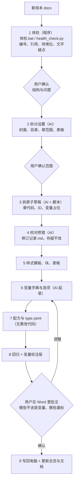

# 新增合同类型

> 把一份新的合同母本变成可生成的合同类型。程序只认内容库：**新增类型不需要改代码**。

## 一个合同类型由什么组成

在 `library/<类型代码>/` 下建目录（类型代码如 `S416`，即表单和配置里的“合同类型”）：

| 文件 / 目录 | 作用 | 必需 |
|---|---|---|
| `type.yaml` | 类型设置；**有这个文件的目录即被识别为一种合同类型** | 是 |
| `recipe.yaml` | 配方：块、目录、原子的顺序，以及“条件”“仅当选项” | 是 |
| `atoms/` | 原子：一条款一个 .md（标记规则见 [使用手册](使用手册.md#原子正文标记对应-word-样式)） | 是 |
| `templates/` | 样式模板 .docx（样式名“合同-章标题”“合同-条款”等需与现有类型一致） | 是 |
| `variables.yaml` | 本类型专属变量（与 `library/common/variables.yaml` 合并，同名以此为准） | 否 |
| `options/` | 本类型专属选项库 | 否 |
| `blocks/`、`tables/` | 封面、目录附件行、价格表等 Word XML | 按需 |
| `reference/` | 母本原件（回归比对用） | 建议 |
| `原子总览.md` | 由 `python -m contract_compose.atom_index <类型>` 生成 | 自动 |

`type.yaml` 示例（以 PO 为例）：

```yaml
名称: PO 实采合同                     # 表单中显示的名称
说明: 实采合同；英文在前；章节从 0 起
样式模板: templates/PO样式模板.docx    # 相对本目录
编号起始: 0                           # 第一章的章号（默认 1）
付款条款: [PAY-02]                    # 付款条款不做“不适用”标注
履约保函条款: null                     # 表单“需要履约保函”对应的条款；没有写 null
表单标签:                             # 覆盖表单中变量的显示名（只对本类型生效）
  质保比例: 质保款（%）
```

共用库中按类型区分的写法，新类型需要时补上自己的一份（缺少时生成会提示具体文件）：
- `library/common/payment_terms.yaml`：付款节点下的 `FA:` / `PO:` 写法、`顺序`、`排版` 等；
- `library/common/options/*.yaml`：`默认: {FA: …, PO: …}` 和各选项的 `适用: [FA, PO]`。

完成后运行 `python -m pytest tests`，确认原有类型的快照不变；再把新类型的示例配置放进 `configs/` 并 `python tests/test_regression.py --update` 生成快照。

# 3. 新增合同类型（母本 → 原子库 + 变量）
由 skill `contract-master-to-atoms` 驱动：**程序发现问题，AI 判断和修改，用户拍板**；每步结束停下来等用户确认；拿不准法律原意的写入“存疑”，不擅自改。




| 步骤 | 做什么 | 谁做 | 产出 |
|---|---|---|---|
| 0 | 确认类型名、母本、语言顺序、章号起点，找最相近的已有类型 | AI + 用户 | — |
| 1 | 体检：编号、引用、待填位、文字疑点、结构大纲 | 程序 | `new_types/<名>/体检报告.md`、`段落.json` |
| 2 | 划定封面、目录、章范围、价格表等范围，起章代码 | AI，用户确认 | `new_types/<名>/拆分设置.md` |
| 3 | 拆原子草稿：一条款一文件，去掉手打编号，引用改 `{{ref:ID}}` | AI + 脚本 | `library/<类型>/atoms/` |
| 4 | 校对修错，写修订记录；存疑不改 | AI，用户拍板存疑 | `library/<类型>/修订记录.md` |
| 5 | 样式模板、块、表格 | AI | `templates/`、`blocks/`、`tables/` |
| 6 | 变量字典与选项库（复用共用库） | AI 起草，用户确认 | `variables.yaml`、`options/` |
| 7 | 配方、`type.yaml`（程序自动识别，无需改代码），生成示例合同与快照 | AI | `type.yaml`、`recipe.yaml`、`configs/示例_*.yaml` |
| 8 | 回归（与母本逐字比对）+ 变量标注版，用户在 Word 批注 | AI + 用户 | `<类型>母本_变量标注版.docx` |
| 9 | 写回电脑，更新原子总览与文档 | AI | — |
