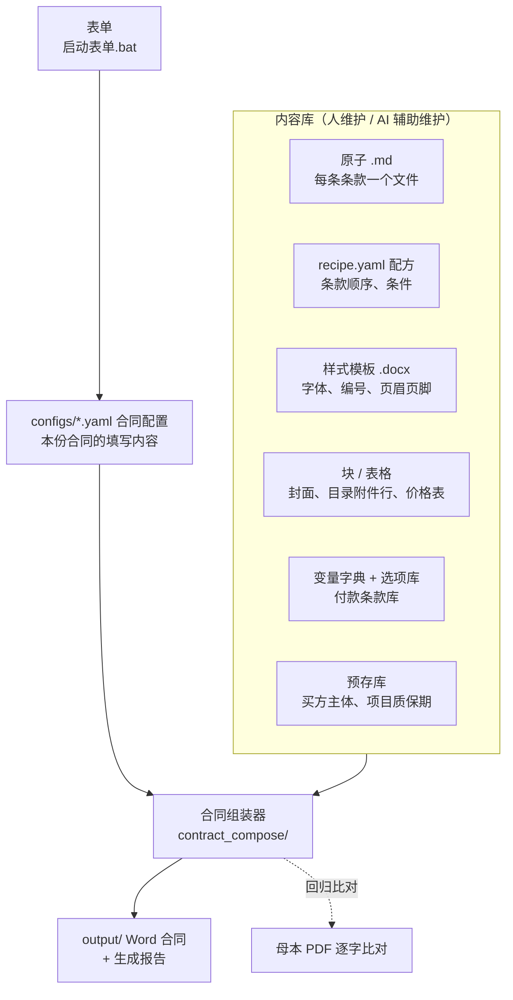

# 架构

> 面向维护者（主要是 AI）：数据怎样流动、代码在哪、改动时要遵守什么。

## 组成

合同 = **原子**（每条条款的文字，ID 固定）× **配方**（条款顺序与条件）× **样式模板**（字体、编号、页眉页脚）× **块 / 表格**（封面、目录附件行、价格表）× **变量与选项**（每份合同不同的内容）。

内容（`library/`）与程序（`contract_compose/`、`ui/`）分开：改合同内容不改代码，新增合同类型也不改代码。

## 1. 总体架构

## 目录结构

| 路径 | 内容 |
|---|---|
| `app.py`、`启动表单.bat`、`安装依赖.bat`、`体检.bat` | 双击入口：表单（左侧切换：合同生成 / 预存信息管理）、安装依赖、母本体检 |
| `requirements.txt`、`requirements-dev.txt` | 运行依赖；开发/测试依赖（pytest） |
| `contract_compose/` | Python 引擎包：`assembler.py` 组装流程（编号、不适用标注）、`library.py` 读取内容库、`options.py` 选项取值、`payment.py` 付款条款、`values.py` 变量替换与派生变量、`money.py` 价款与大写、`docx_writer.py` 写 Word、`presets.py` 预存库读写、`maintenance.py` 条款维护（文字）、`structure.py` 结构维护（增删移动）、`variable_admin.py` 变量管理、`snapshots.py` 回归快照、`paths.py` 全部路径、`constants.py` 常量、`cli.py` 命令行；新增类型工具：`master_parser.py` 母本解析、`health_check.py` 体检、`atom_index.py` 原子总览 |
| `ui/` | 表单页面：`contract_form.py` 合同生成、`preset_manager.py` 预存信息管理 |
| `library/common/` | 共用内容：`variables.yaml` 变量字典、`payment_terms.yaml` 付款条款库、`options/` 选项库（付款方式、质保方式、质保期）、`presets/` 预存库（买方主体、项目信息；`backups/` 为自动备份，不进 git） |
| `library/FA/`、`library/PO/` | 各类型：`atoms/` 原子、`recipe.yaml` 配方、`variables.yaml` 专属变量、`options/` 专属选项、`templates/` 样式模板、`blocks/` 封面/目录附件行/前言等、`tables/` 表格、`reference/` 母本原件、`原子总览.md` |
| `library/FA/reference/FA母本_v2.docx` | FA 批注版母本（回归比对用） |
| `library/PO/PO母本_变量标注版.docx`、`library/PO/修订记录.md` | PO 变量标注版；PO 母本中已修改的错误、改为变量的内容、存疑问题 |
| `configs/` | 每份合同一个配置文件（合同类型、填写的变量、选用的写法） |
| `output/` | 生成的合同和生成报告（不进 git，只保留两份示例） |
| `new_types/` | 新增合同类型的中间产物：体检报告、拆分设置、一次性转换脚本 |
| `docs/diagrams/` | 流程图：Mermaid 源码（.mmd）和 PNG |
| `tests/` | 回归测试：`snapshots/` 快照、`cases/` 额外测试配置；有意修改后用 `python tests/test_regression.py --update` 更新快照 |

## 代码模块与调用顺序

`build(cfg)`（`assembler.py`）一次组装的流程：

1. `library.load_library(类型)` → `Library`：`settings`（type.yaml）、`atoms`、`recipe`、`V`（变量字典，类型覆盖公共）、`opts`（选项库，按类型过滤，并入预存库项目条款）、`pay`（付款条款库）、`entities`（买方主体）。
2. 合并变量：配置中的变量 → 买方主体预存值 → `values.derive_values` 计算价款、大写、技术协议说明。
3. 确定不适用条款：配方“条件”不成立、“仅当选项”不符、配置“不适用”；`settings['付款条款']` 除外；章标题不适用则整章继承。
4. `numbering` 按顺序算出条款号（起点 `settings['编号起始']`），供 `{{ref:ID}}` 和目录使用。
5. 每个原子：`values.expand_options`（选项、付款方案 → `payment.render_payment`）→ `values.resolve_values`（值变量，两遍以展开嵌套）→ 替换引用 → 不适用标注。
6. `docx_writer.Writer` 按样式模板写段落、编号、块、表格、目录；页眉页脚也做变量替换。
7. 配方有“附件”时（`annexes.py`）：按“附件/顺序”编号，按配置“附件”定有 / 无；目录中生成附件行，最后一条条款后另起一页写第二部分（附件清单表 + 有正文且“有”的附件正文）。`{{附件:ID}}` 等引用在第 5 步之前替换。

| 模块 | 职责 |
|---|---|
| `paths.py` | 全部目录与固定文件名（改目录只改这里） |
| `constants.py` | 与类型无关的常量（未填标记、不适用后缀等） |
| `library.py` | `list_types` 识别类型、`load_type` 读 type.yaml、`load_library` 读内容库、`for_type` 取按类型区分的值 |
| `options.py` | `choose` 选项取值（明确选择 → 项目预设 → 跟随变量 → 默认）、预存库条款并入选项 |
| `payment.py` | 付款节点与单据组装（FA 列项排版 / PO 子条款排版） |
| `values.py` | 派生变量、选项展开、值变量替换 |
| `money.py` | 价款计算、中英文大写、数字转中英文 |
| `docx_writer.py` | Word 写入 |
| `presets.py` | 预存库读写（写前备份） |
| `maintenance.py` | 条款维护：列表 / 查找、检查、预览、对比、保存（备份 + 试生成 + 修订记录 + 更新快照）、历史与恢复 |
| `structure.py` | 条款新增 / 移除 / 恢复 / 移动，附件排序 / 默认 / 新增 / 移除；只改 recipe.yaml 相关行，保留注释 |
| `variable_admin.py` | 变量用在哪里、改默认值与说明、把文字改成变量；只改 variables.yaml 相关行 |
| `snapshots.py` | 回归快照的生成与更新（测试和条款维护页面共用） |
| `annexes.py` | 合同附件：编号、有 / 无、`{{附件:ID}}` 引用 |
| `assembler.py` | 组装流程 `build`、`numbering` |
| `cli.py` / `__main__.py` | 命令行 `python -m contract_compose` |
| `master_parser.py`、`health_check.py`、`atom_index.py` | 新增类型工具：母本解析、体检、原子总览 |
| `ui/contract_form.py`、`ui/preset_manager.py`、`ui/clause_editor.py` | Streamlit 表单页面：合同生成、预存信息管理、条款维护（`app.py` 为入口） |

## 维护约定

- **改完必跑测试**：`python -m pytest tests`。回归快照（`tests/snapshots/`）覆盖示例配置、母本回归、变量标注版；表单测试覆盖两种类型、打开配置、点“生成合同”、预存信息页。
- **用户在“条款维护”页面保存的修改**会自动更新快照并记入 `修订记录.md` 的“条款维护记录”，这类快照变化是用户确认过的内容修改。
- **快照只在有意修改时更新**：条款、模板、变量默认值的改动确认无误后，`python tests/test_regression.py --update`，并在提交说明里写清差异原因。纯重构不应改变任何快照。
- **命名**：目录和程序固定读取的文件用英文（`atoms/`、`recipe.yaml`、`type.yaml`…）；内容本身（原子文件名、选项库文件名、yaml 键名）和给人看的文档（`原子总览.md`、`修订记录.md`）用中文——它们是数据的一部分，改名会影响变量和选项的引用。
- **原子 ID 一经分配不改**；条款号由顺序自动计算。
- **块 / 表格 XML 不手改**，由母本拆出；样式模板改动前先告知用户。
- **生成物不进 git**：`output/`（只留两份示例）、`presets/backups/`、`__pycache__/`。
